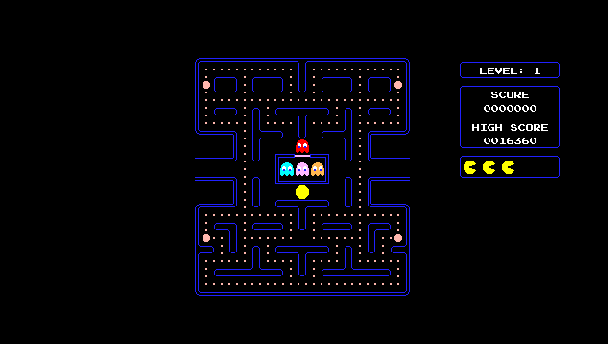

# Pac-Man in Godot

A Pac-Man clone that I made for the [20 Games Challenge](https://20_games_challenge.gitlab.io/).

The Ghost were by far the hardest part of this project, I tried to make their AI as close to the original as I possible. Overall I'm happy with how this project turned out.

## Resources Used

- Font: https://www.fontspace.com/emulogic-font-f3327
- Sound Effects: https://www.sounds-resource.com/arcade/pacman/sound/10603/
